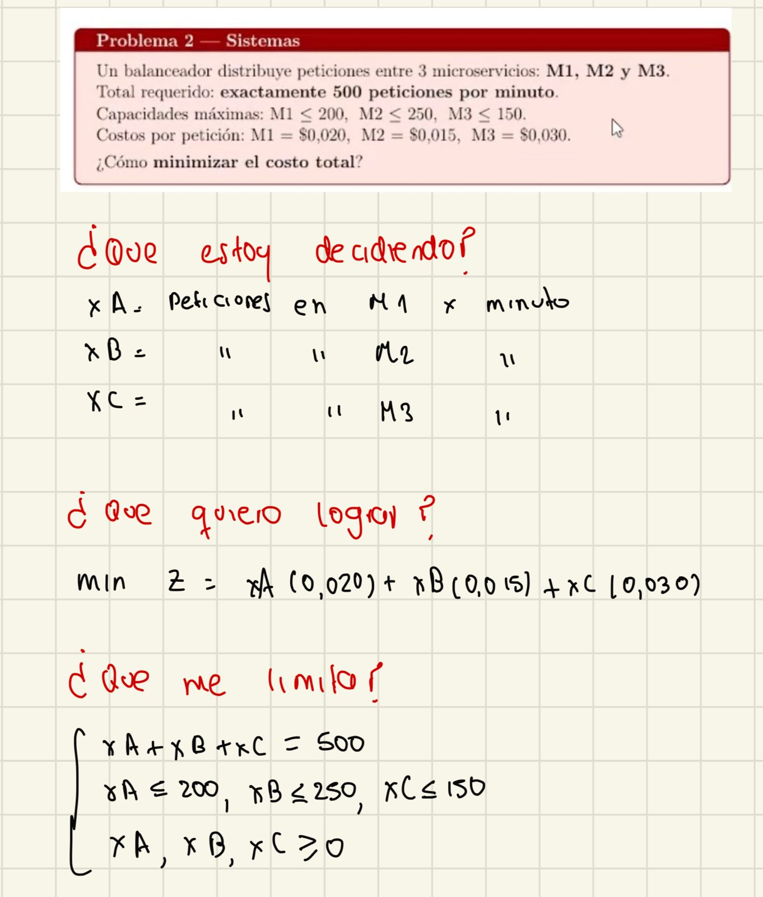
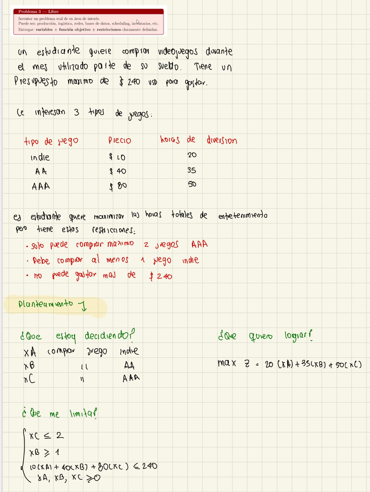

# Tarea 1 - Optimizacion

## Problema 1

**Que estoy decidiendo?**
- x_A: panes producidos al dia
- x_B: tortas producidas al dia

**Que quiero lograr?**
maximizar la ganancia

Z = 2(x_A) + 6(x_B)

**Que me limita?**

1(x_A) + 3(x_B) ≤ 18

x_B ≥ 2

x_A ≥ 0, x_B ≥ 0

## Imagen del desarrollo

## Problema 2 - Sistemas

### **Que estoy decidiendo?**

- xA: peticiones en M1 por minuto
- xB: peticiones en M2 por minuto
- xC: peticiones en M3 por minuto

### **Que quiero lograr?**

Minimizar el costo total:

min Z = xA(0.020) + xB(0.015) + xC(0.030)

### **Que me limita?**

xA + xB + xC = 500

xA ≤ 200  
xB ≤ 250  
xC ≤ 150  

xA, xB, xC ≥ 0

## Imagen del desarrollo

## Problema 3 (Libre)

## **Que estoy decidiendo?**

- \(x_A\): numero de juegos Indie a comprar  
- \(x_B\): numero de juegos AA a comprar  
- \(x_C\): numero de juegos AAA a comprar  

---

## **Que quiero lograr?**

Maximizar las horas totales de entretenimiento:

max Z = 20x_A + 35x_B + 50x_C

---

## **Que me limita?**

x_C ≤ 2

x_A ≥ 1

10x_A + 40x_B + 80x_C ≤ 240

x_A, x_B, x_C ≥ 0

---

## Desarrollo a mano

