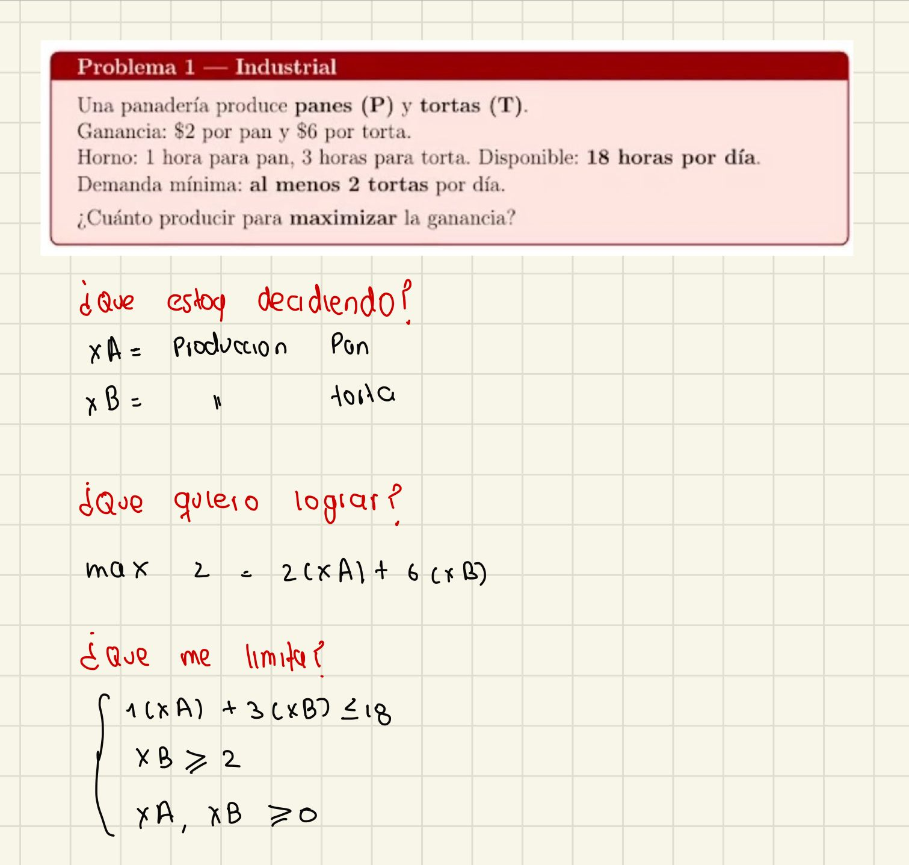

# Tarea 1 - Optimizacion

## Problema 1

### Planteamiento del modelo

**Variables de decision**
- x_A: panes producidos al dia
- x_B: tortas producidas al dia

**Funcion objetivo**
maximizar la ganancia

\[
Z = 2(x_A) + 6(x_B)
\]

**Restricciones**

\[
1(x_A) + 3(x_B) \leq 18
\]

\[
x_B \geq 2
\]

\[
x_A \geq 0,\quad x_B \geq 0
\]

## Imagen del desarrollo

